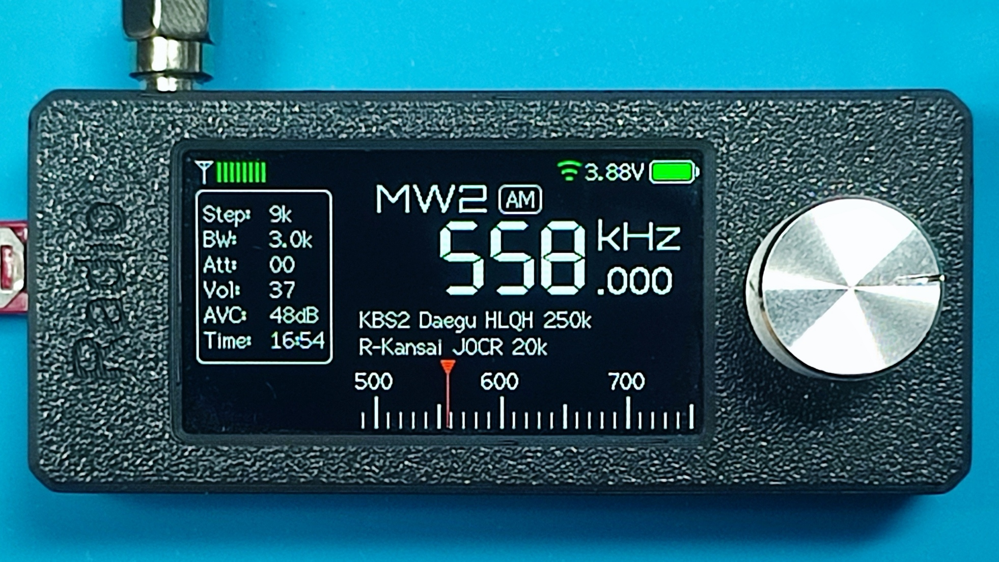
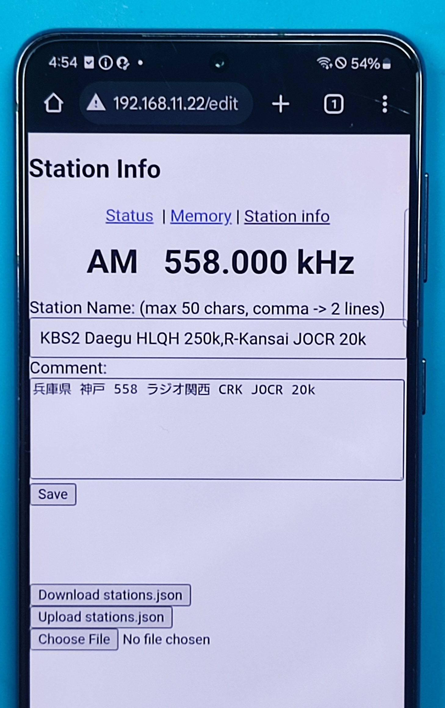

# ATS-MINI Manual Station Name Assignment Patch

> This is a small patch for ATS-MINI v2.30 that allows you to assign custom station names to frequencies.  
> All copyrights to the original ATS-MINI project belong to its author.

This is a personal modification of the ATS-MINI project (v2.30), created to suit my own receiving style.  
This patch allows you to manually assign station names using the ATS-MINI web interface.

## Features

- When you tune a frequency with the ATS-MINI dial as usual, the frequency is synchronously displayed in the web browser.
- Enter station names and comments via the web browser.
- Station names are displayed on the ATS-MINI screen in two lines, separated by a comma.
- Station information is stored internally in JSON format.

## How to apply this patch

This patch is based on ATS-MINI v2.30.

```bash
git clone https://github.com/esp32-si4732/ats-mini.git
cd ats-mini
git checkout v2.30
git apply my-station-name.patch
```

## Build
```bash
arduino-cli compile --clean -e -p COM_PORT -u ats-mini
```

## Note
If the ESP32 tool download times out during build:
```bash
arduino-cli config set network.connection_timeout 1200s
```

## Disclaimer

This patch is not an official feature of ATS-MINI.
It is a personal modification created for experimental purposes.

All credit for the original project goes to the ATS-MINI author.

---

## Screenshots and Demo video

### ATS-MINI Screen


### Web UI


### Demo video
[](https://youtube.com/shorts/gAheYQwOAIc)
